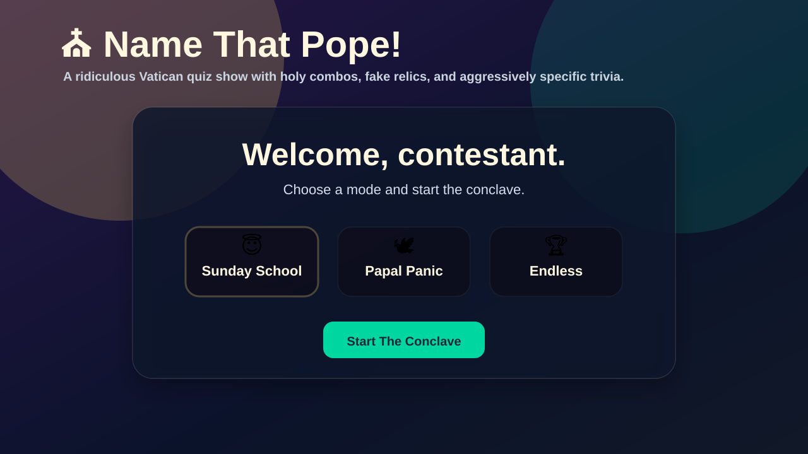
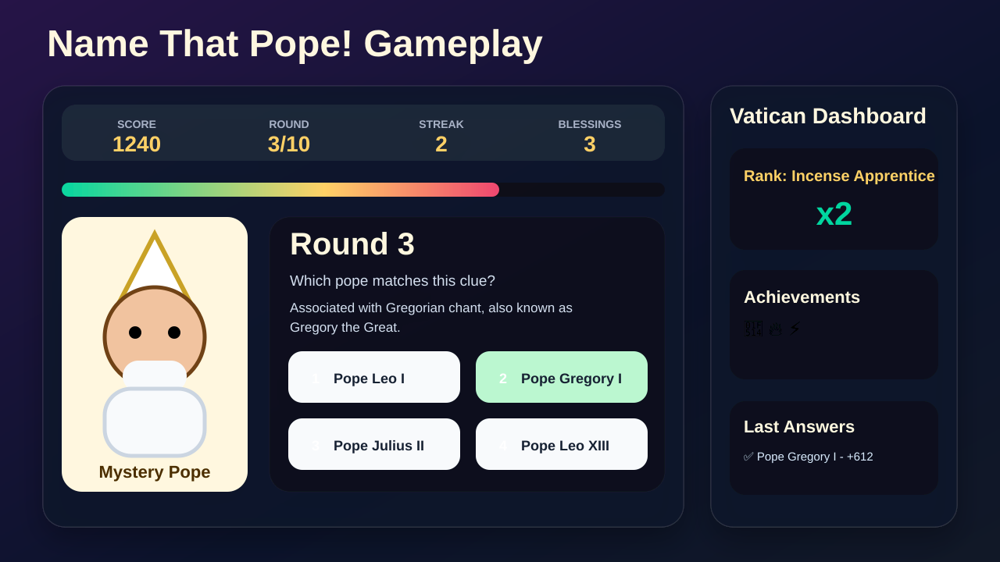

# Name That Pope!

## [Play the game on GitHub Pages](https://brandon-valley.github.io/NameThatPope/)

A ridiculous, fast-moving Vatican trivia game where you identify popes from clues, build holy combos, unlock achievements, and use emergency blessings when every pope name starts sounding the same.



## What is this?

**Name That Pope!** is a single-file browser game built with plain HTML, CSS, and JavaScript. No install, no build step, no backend, and no dependencies. Open the GitHub Pages link and play.

The game asks papal-history multiple choice questions with a deliberately goofy quiz-show style. It includes scoring, streaks, achievements, game modes, keyboard controls, animations, sound effects, and confetti.

## Screenshots

### Start screen


### Gameplay



## Features

- **Three game modes**
  - **Sunday School**: 10 rounds, funny but fair.
  - **Papal Panic**: 12 rounds, shorter timer, extra chaos events.
  - **Conclave Endless**: keep playing until your blessings run out.
- **Animated pope card** with a mystery pope reveal after each answer.
- **Combo scoring** that rewards correct-answer streaks.
- **Blessings** that remove two wrong answers when you get stuck.
- **Achievements** for streaks, fast answers, no-blessing runs, and perfect games.
- **Keyboard support**: press `1` through `4` to answer, `B` to use a blessing, and `Space` or `Enter` to continue.
- **No dependencies**: everything lives in `index.html`.

## How to play

1. Open the live game: <https://brandon-valley.github.io/NameThatPope/>
2. Pick a mode.
3. Read the clue.
4. Choose the pope that matches.
5. Build your streak, use blessings wisely, and try to earn the best rank.

## Project structure

```text
NameThatPope/
├── index.html
├── README.md
└── docs/
    └── screenshots/
        ├── start-screen.svg
        └── game-screen.svg
```

## Running locally

Because this is a static HTML game, you can run it by opening `index.html` directly in a browser.

For a local server, you can also use:

```bash
python3 -m http.server 8000
```

Then open:

```text
http://localhost:8000
```

## Deployment

This repo is designed for GitHub Pages. The live site is served from `index.html` on the `main` branch.

Live page:

<https://brandon-valley.github.io/NameThatPope/>

## Tech stack

- HTML
- CSS
- JavaScript
- GitHub Pages

## Notes

This is a silly trivia game, not a seminary entrance exam. Some wording is intentionally goofy, and the whole point is to make pope trivia feel like an overproduced game show.
